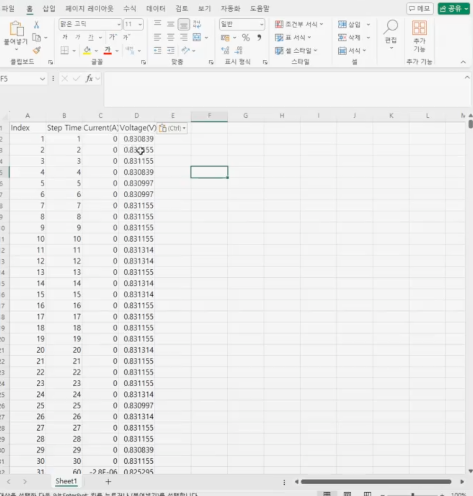
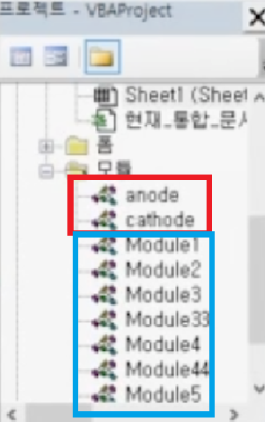
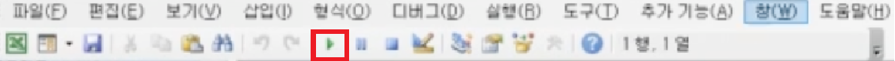
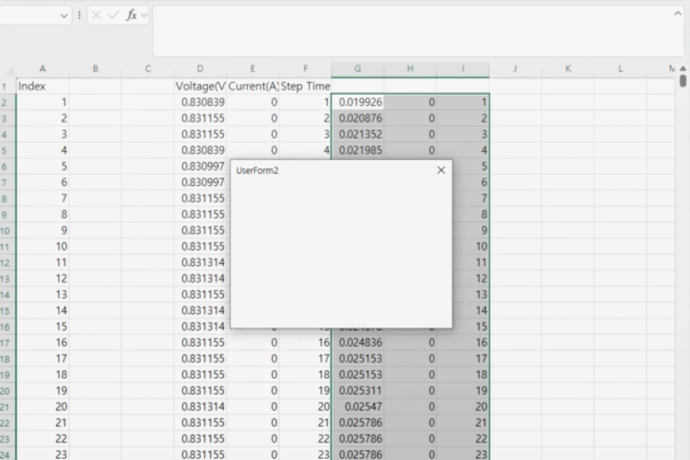
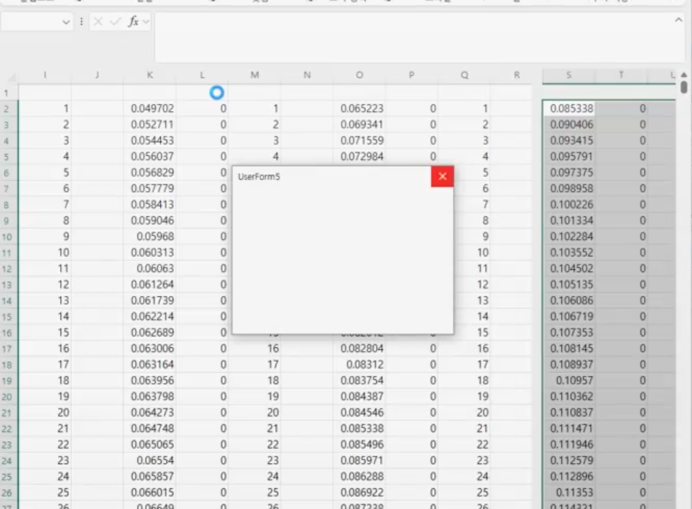
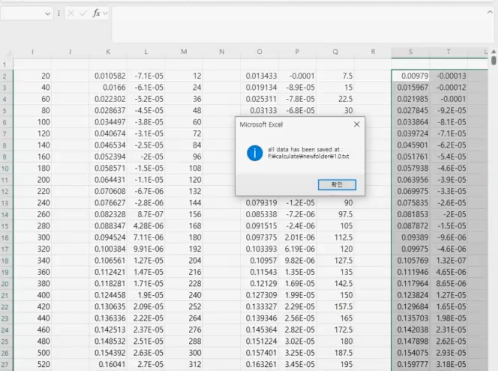
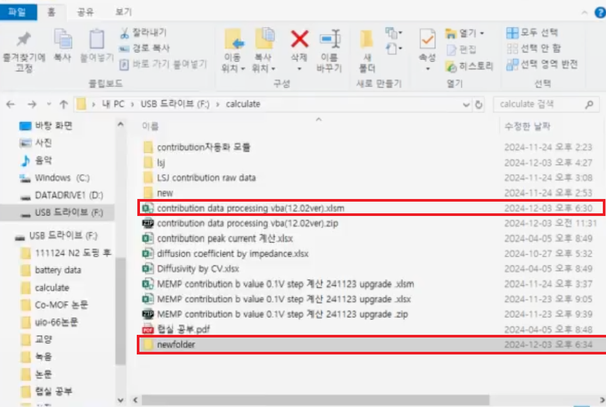
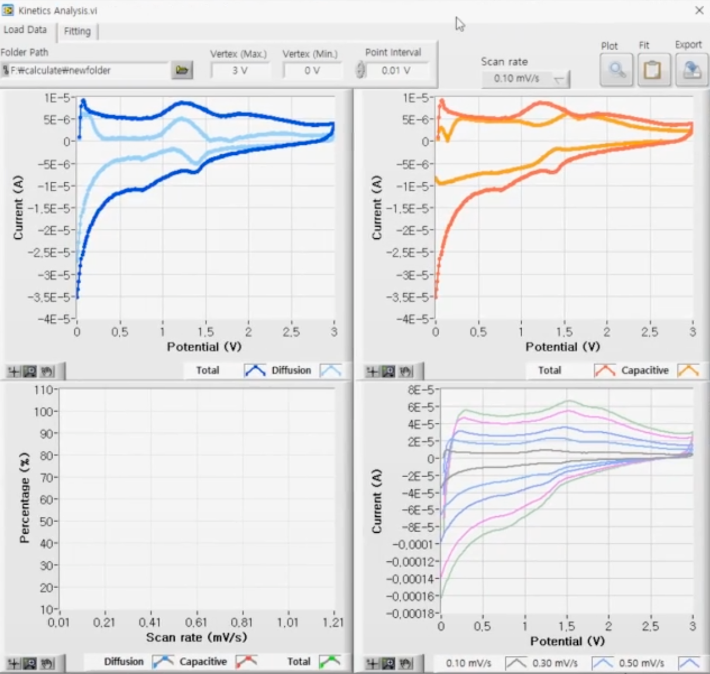

# [Project 2] 실험 데이터 전처리 자동화 프로그램 개발 (Excel VBA)

> **프로젝트 요약**  
> 이차전지 CV(Cyclic Voltammetry) 측정 시 발생하는 대용량 Raw Data의 전처리 과정을 수작업에서 **알고리즘 기반 자동화 시스템**으로 전환.  
> 공정 소요 시간을 **95% 단축(20분 → 1분)**하고 휴먼 에러를 원천 차단하여 연구실 데이터 신뢰성 및 업무 효율을 혁신적으로 개선함.

---

## 1. 배경 및 문제 정의 (Background & Problem)

**"반복적이고 비효율적인 수작업 공정의 한계"**

이차전지 소재 연구 과정에서 전지 특성을 파악하기 위해 CV(순환전압전류법) 측정을 필수적으로 수행합니다. 그러나 장비에서 추출된 **Raw Data(초기 데이터)**는 즉시 분석에 활용하기 어려운 형태였습니다.

*   **대용량 데이터의 복잡성:** 1회 측정 시 수십만 행(Row)에 달하는 엑셀 데이터가 생성되며, 유의미한 CV 곡선을 얻기 위해서는 불필요한 구간(더미 데이터)을 제거하고 5가지 Scan Rate별로 데이터를 분류해야 했습니다.
*   **비효율적인 작업 프로세스:** 기존에는 연구원이 직접 `Step Time`, `Current`, `Voltage` 열을 눈으로 확인하고 스크롤을 내리며 수동으로 데이터를 삭제/분류했습니다.
*   **높은 시간 비용과 오류 위험:** 셀 1개당 전처리에 약 **20분**이 소요되었으며, 수작업 특성상 유효 데이터를 실수로 삭제하는 등의 **휴먼 에러(Human Error)**가 빈번히 발생하여 실험 결과의 신뢰도를 저해했습니다.



*(캡션: 자동화 전, 수십만 행에 달하는 Raw Data 모습. 육안으로 식별 및 분류가 필요했음)*

---

## 2. 해결 방안 및 기술 구현 (Solution & Logic)

**"Excel VBA를 활용한 공정 자동화 솔루션 개발"**

접근성이 높고 동료 연구원들이 별도 설치 없이 사용할 수 있는 **Excel VBA(Visual Basic for Applications)**를 채택하여 전처리 자동화 프로그램을 직접 개발했습니다.

### 2-1. 알고리즘 설계 및 모듈화
*   **조건부 필터링 구현:** 반복문(Loop)과 조건문(If)을 활용하여 전류(Current) 및 전압(Voltage)의 변화를 감지, 유효한 Cycle 구간만 추출하고 노이즈 데이터를 자동 삭제하는 로직을 구현했습니다.
*   **Dual Mode 지원:** Anode(음극)와 Cathode(양극)의 전기화학적 측정 메커니즘 차이를 반영하여, 각각에 최적화된 처리 모듈(Module 1~5)을 분리 설계하여 정확도를 높였습니다.


*(캡션: 모듈 단위로 구조화하여 유지보수 용이성을 높인 VBA 코드 일부)*



(캡션: 음극(anode)버전과 양극(cathode)버전을 만들어 연구생 모두가 사용가능하게 범용성 확보)

> **[Reference]** 각 모듈별 상세 코드 로직 및 알고리즘 설명 영상 (아래사진 클릭!)
[](https://www.youtube.com/watch?v=pBTxCt7FUQk)

###  2-2. 사용자 접근성(Accessibility) 및 표준화
- **간편한 실행 프로세스:** 별도의 프로그램 설치나 복잡한 조작 없이, 엑셀 내장 매크로의 **'실행(Run)' 버튼 클릭 한 번**으로 전처리가 수행되도록 하여 코딩을 모르는 동료들도 즉시 사용할 수 있는 환경을 구축했습니다.
    
- **결과물 자동 생성:** 전처리가 완료되면 원본 데이터를 보존한 상태로, 정리된 엑셀 파일과 시각화 툴 호환용 .txt 파일을 포함한 결과 폴더가 자동으로 생성되도록 설계했습니다.


(캡션: 복잡한 설정 없이 원클릭으로 전처리를 수행할 수 있는 실행 화면)

### 2-3. 데이터 처리 및 정렬 실행 과정 (Processing Visualization)

실행 버튼을 클릭하면 프로그램이 수만 행의 데이터를 실시간으로 스캔하며 재정렬을 수행합니다. 아래 사진들은 실제 프로그램 구동 시 데이터가 분류되는 과정입니다.
   
*(캡션: 알고리즘에 의해 불필요한 행이 삭제되고, Scan Rate 별로 데이터가 자동 정렬되는 실시간 처리 모습)* 

**[Demo]** 프로그램 실제 구동 및 결과 확인 영상(간략한 설명포함) (아래사진 클릭!)
[](https://www.youtube.com/watch?v=nqmYlnn32i0)

### 2-4. 핵심 모듈별 알고리즘 상세 (Key Algorithm Logic)

본 프로그램은 배터리 데이터 특성에 맞춰 단계별로 정밀한 전처리를 수행합니다. 각 모듈은 독립적으로 기능하며, 소재(음극/양극)에 따라 유연하게 적용됩니다.


#### **① Module 2: 노이즈 제거 및 Scan Rate 자동 분류**

-   **기능:** 장비 대기 상태(Idle)에서 발생하는 `Current = 0`인 무의미한 데이터를 제거하고, 연속된 실험 데이터를 5가지 Scan Rate(0.1 ~ 1.0 mV/s)별로 인식하여 별도의 열(Column)로 분리합니다.
-   **로직:** 전류값(Current)을 스캔하여 **0이 아닌 유효 데이터**의 시작점을 찾아 그 이전 행을 삭제하고, 다시 **0이 나오는 지점(다음 실험 대기 구간)**을 찾아 데이터를 잘라내어(Cut) 옆 열로 이동시킵니다.

```vb
' [Module2.bas]
' 1. Remove rows where current equals zero (Noise Removal)
If dValue <> 0 Then
    firstNonZeroRow = currentRow
    Exit For ' Exit loop after finding the first non-zero value
End If
ws.Rows("2:" & lastZeroRow).Delete

' 2. Cut data for next scan rate (Classification)
If dValue = 0 Then
    zeroRow = currentRow ' Store the row number of the first zero value
    Exit For
End If
Set rangeToCut = ws.Range("C" & zeroRow & ":E" & lastRow)
rangeToCut.Copy
ws.Range("G" & 2).PasteSpecial Paste:=xlPasteValues ' Move to next column
```

#### ② Module 3 & 33: 초기 전압 구간 트리밍 (Start Point Alignment)

- **기능:** 실험 시작 시점(OCV)에서 실제 반응 시작 전압까지 이동하는 불필요한 초기 경로(Tail)를 제거하여, 모든 데이터의 시작점을 0V(또는 Peak)로 통일합니다.
Dual Mode 로직:
- Module 3 (Anode): 전압이 하강하다가 상승하기 시작하는 변곡점을 찾아 그 이전 데이터를 삭제합니다.
- Module 33 (Cathode): 전압이 상승하다가 하강하기 시작하는 변곡점을 찾아 그 이전 데이터를 삭제합니다.

```vb
' [Module3.bas] - Anode Example
' Traverse column data to find the turning point
For currentRow = 3 To lastRow
    currentValue = ws.Cells(currentRow, "C").Value
    
    ' If the value starts increasing (Turning Point), store the row number
    If currentValue > previousValue Then
        increasingRow = currentRow
        minRow = increasingRow - 1
        Exit For
    End If
    previousValue = currentValue
Next currentRow

' Delete the initial decreasing region
For i = minRow To 2 Step -1
    ws.Cells(i, 3).Delete Shift:=xlUp
Next i
```

#### ③ Module 4 & 44: Cycle 최적화 및 오류 방지

- **기능:**: 2 Cycle로 측정된 데이터에서 불안정한 1st Cycle을 제거하고, 안정화된 2nd Cycle만 추출합니다.
- **목적:** 다중 Cycle 데이터를 Kinetics 분석 소프트웨어에 입력할 때 발생하는 그래프 깨짐 현상(Scattered Plot Bug)을 방지하고 데이터 신뢰성을 확보합니다.
- **로직:** 전압의 증감 패턴(Increase ↔ Decrease)을 추적하여 **두 번째 주기가 시작되는 정확한 행(Row)**을 감지하고, 그 이전의 모든 데이터를 제거합니다.

```vb
' [Module4.bas]
' Find the point where voltage decreases and then increases again (2nd Cycle Start)
If foundStart And Not foundEnd Then
    ' ... (Skip decreasing part) ...
    
    ' Moment when voltage starts increasing again
    If ws.Cells(i, currentColumn).Value > ws.Cells(i - 1, currentColumn).Value Then
        endOfCycle = i ' Store the row index where 2nd cycle resumes
        foundEnd = True
        Exit For
    End If
End If

' Delete the first cycle data
If foundStart' [Module4.bas]
' Find the point where voltage decreases and then increases again (2nd Cycle Start)
If foundStart And Not foundEnd Then
    ' ... (Skip decreasing part) ...
    
    ' Moment when voltage starts increasing again
    If ws.Cells(i, currentColumn).Value > ws.Cells(i - 1, currentColumn).Value Then
        endOfCycle = i ' Store the row index where 2nd cycle resumes
        foundEnd = True
        Exit For
    End If
End If

' Delete the first cycle data
If foundStart
```


---

## 3. 결과 및 성과 (Results)

프로그램 도입 후 연구실 내 데이터 처리 프로세스가 획기적으로 개선되었습니다.

1.  **공정 시간 단축 (Efficiency):** 기존 20분 소요되던 작업이 **1분 미만으로 단축(약 95% 효율 향상)**되었습니다. 반복 노동 시간을 줄여 연구원들이 데이터 해석과 실험 설계에 집중할 수 있는 환경을 조성했습니다.
2.  **데이터 품질 향상 (Quality):** 프로그램 로직에 의한 일관된 처리로 **데이터 핸들링 실수(Human Error) 0건**을 달성, 실험 결과의 신뢰도를 확보했습니다.
3.  **조직 기여 (Contribution):** 연구실 공용 툴로 배포되어 모든 연구원이 사용 중이며, 신규 인원에게 복잡한 전처리 방법을 교육하는 비용(시간) 또한 절감되었습니다.


*(캡션: 프로그램 구동 완료 후 자동으로 생성된 결과 파일 및 폴더)*


*(캡션: 자동화 프로그램을 통해 확보한 데이터를 시각화한 최종 CV 그래프)*

---

## 4. 직무 연관성 및 핵심 역량 (Core Competencies)

본 프로젝트는 단순한 코딩 경험을 넘어, **공정/품질 엔지니어**로서 갖춰야 할 핵심 역량을 증명합니다.

*   **Process Optimization (공정 최적화):** 비효율적인 프로세스를 방치하지 않고, 문제의 원인을 분석하여 기술적인 도구로 해결책을 제시하고 정량적인 성과를 도출했습니다.
*   **Data Analytics Capability (데이터 분석 역량):** 대량의 실험 데이터를 핸들링하는 로직을 직접 설계함으로써, 향후 반도체/배터리 제조 현장의 수율 데이터 분석 및 품질 관리 시스템 운영에 기여할 수 있습니다.
*   **Collaboration & Standardization (협업 및 표준화):** 개인의 편의를 넘어 조직 전체가 사용할 수 있는 표준 툴을 제작하고 배포함으로써 팀 전체의 성과(Output)를 높이는 데 기여했습니다.